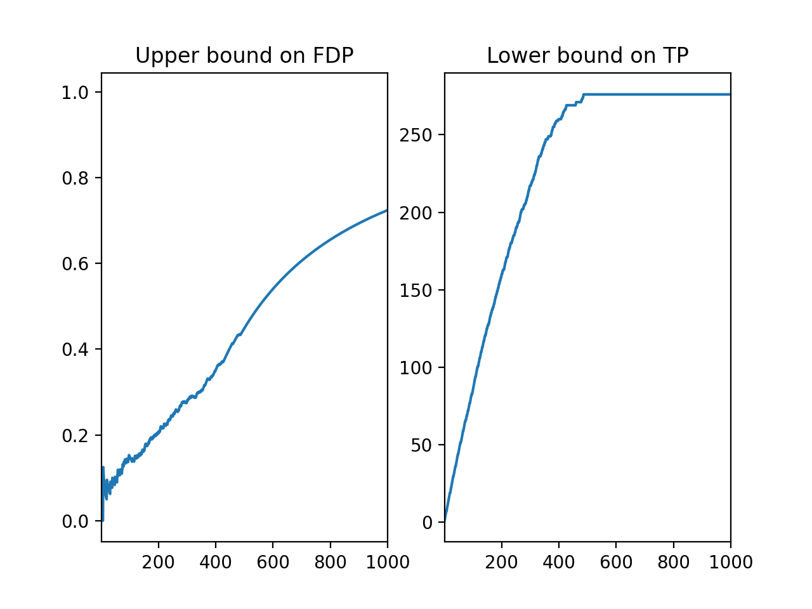

# sanssouci.python

### General presentation

Post hoc inference via multiple testing

The goal of this projet is to port the [R package sansSouci](https://pneuvial.github.io/sanssouci/) to python.

Authors: [Laurent Risser](http://laurent.risser.free.fr/) and [Pierre Neuvial](https://www.math.univ-toulouse.fr/~pneuvial/).

### Permutation-based confidence envelopes

A typical output is shown below:



The left plot displays an upper confidence envelope on the False Discovery Proportion among the most significant voxels. The right plot displays a lower confidence envelope on the number of True Postives among the most significant voxels. See the [Script to reproduce this plot](./examples/posthoc_fMRI.py).

### Test the package on synthetic data

Here is a simple code you can use to test and get familiar with the *sanssouci* package. Other examples are given in the *examples* directory.

```
import sanssouci as sa
import numpy as np


#1) generate phantom data
p = 130
n = 45


X=np.random.randn(n,p)  #NOTE: no signal!! we expect trivial bounds
categ=np.random.binomial(1, 0.4, size=n)


#2) test the algorithm
B = 100
pval0=sa.get_perm_p(X, categ, B=B , row_test_fun=sa.row_welch_tests)

K=p
piv_stat=sa.get_pivotal_stats(pval0, K=K)


#3) Compute Bounds

alpha=0.1

lambda_quant=np.quantile(piv_stat, alpha)
thr=sa.t_linear(lambda_quant, np.arange(1,p+1), p)
swt=sa.row_welch_tests(X, categ)
p_values=swt['p_value'][:]
pvals=p_values[:10]

bound = sa.max_fp(pvals, thr)
print(bound)

```
